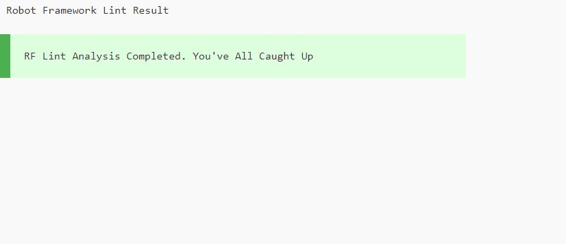
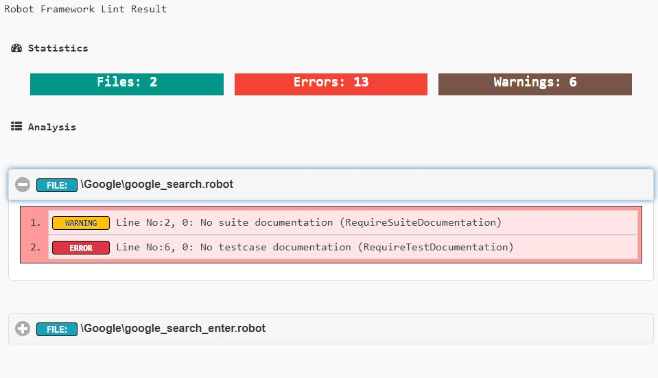

# Robot Framwork Lint Report

Creates HTML Report based on rflint output

---

*How it Works:*

1. Execute rflint command for entire project and publish result to __rflint_result.txt__ file
    ```rflint . > "rflint_result.txt"```  
2. Convert __rflint_result.txt__ to __rflint_result.html__ report using Beautifulsoup

---

*How to use in project:*

1. Clone project or download here [link](https://github.com/adiralashiva8/RFLintReport/archive/master.zip)
    ```
    git clone https://github.com/adiralashiva8/RFLintReport.git
    ```
2. Copy __rflint_convert_text_to_html.py__ and __rflint_executer.bat__ files to project (should be within project folder location)
3. Install beautifulsoup: (to create html report - one time activity)
    ```
    pip install beautifulsoup4
    ```
4. Execute __rflint_executer.bat__ file
5. __Robot Framework Lint Report__ will be launched in new chrome tab

    > Assumption __Python__ already installed in machine

---
---

 *Sample Report:*

 __WITHOUT ERRORS__



__WITH ERRORS__

 

---

*Credits:*

1. RFLint - Bryan [link](http://robotframework.org)
2. W3Schools [link](http://www.w3schools.com)
3. BeautifulSoup [link](http://beautiful-soup-4.readthedocs.io)
4. Bootstrap [link](https://getbootstrap.com/)
5. Icons8 [link](https://icons8.com/)
6. FontAwesome [link](https://fontawesome.com)

---

> You are watching first HTML 'RFLint Report' in Robot framework.

---